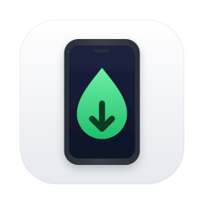
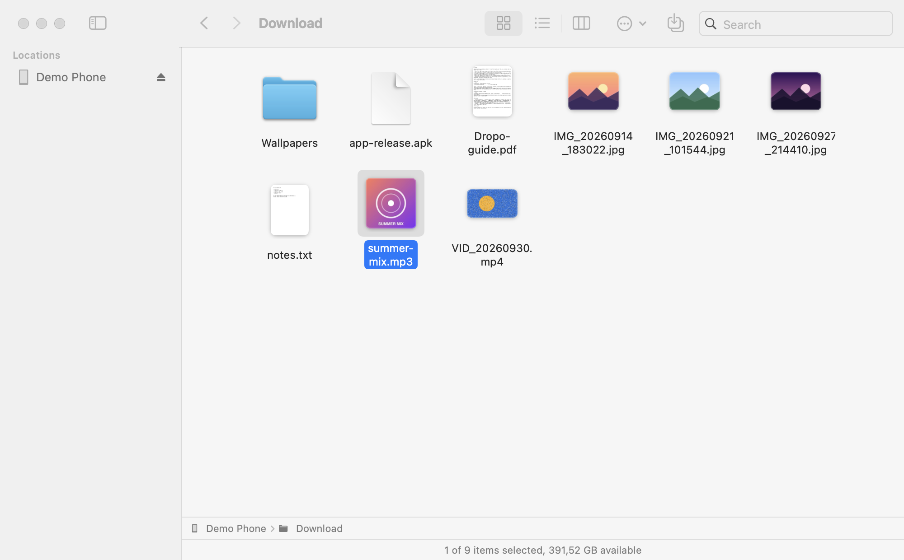
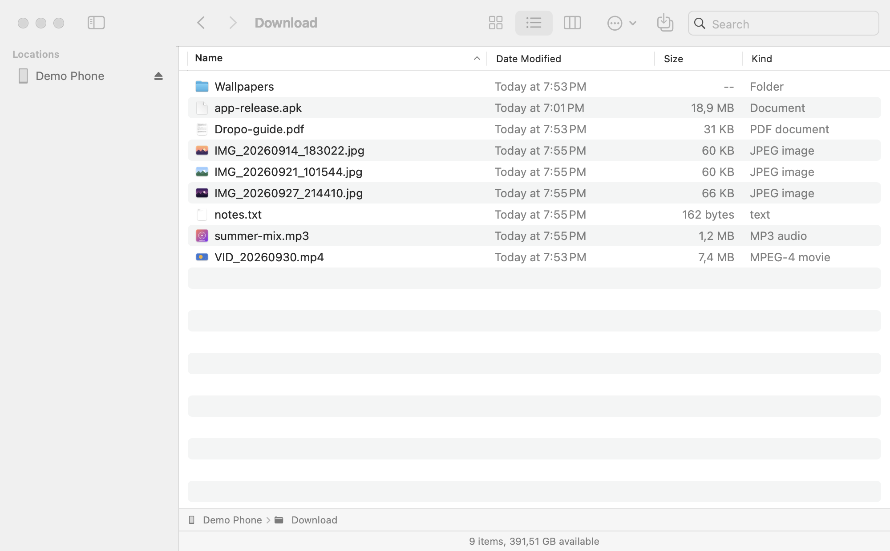
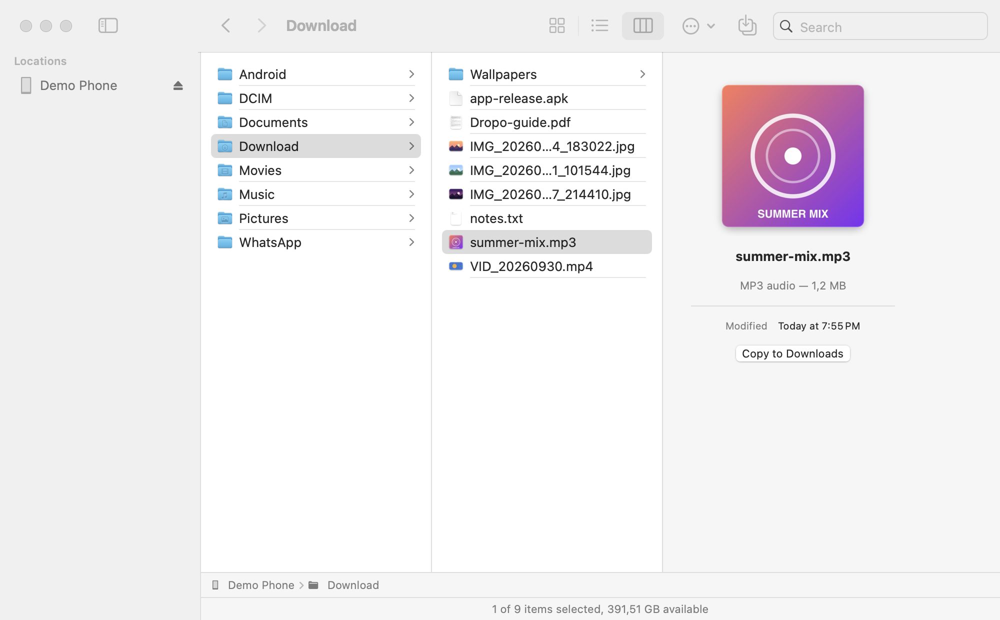

<div align="center">

<picture>
  <source media="(prefers-color-scheme: dark)" srcset="docs/icon-dark.png">
  
</picture>

# Dropo — Android File Transfer for Mac

**Browse, copy and manage your Android phone's files on macOS — in a window that works just like Finder.**

Plug in your phone over USB and its storage shows up with real thumbnails, album art and video previews.
Drag files to and from the Mac, Quick Look them, rename, delete and organise — no Android File Transfer, no ads, no Electron.


</div>

<picture>
  <source media="(prefers-color-scheme: dark)" srcset="docs/screenshots/icons-dark.png">
  
</picture>

## Why Dropo?

Moving files between an Android phone and a Mac has always been awkward. Google's **Android File Transfer** app is
discontinued and flaky on modern macOS, and macOS itself can't read or write Android phones over USB, because they use
**MTP (Media Transfer Protocol)** instead of showing up as a drive.

Dropo is a small, native macOS app that speaks MTP and presents your phone the way you already know: **icon, list and
column views, the Finder sidebar, path bar, Quick Look and the same keyboard shortcuts**. It's built in Swift and SwiftUI
on top of the proven open-source [libmtp](https://github.com/libmtp/libmtp) library.

## Features

- **Finder-style browsing**: icon, list and column views, sortable columns (name, date, size, kind), path bar, status bar with free space, multiple windows and tabs, light and dark mode.
- **Real previews, like on your Mac**: phone photo thumbnails, **MP3 album art**, **video first frames**, **PDF and document pages**, and Finder's own file icons. Dropo reads only the few hundred KB each preview needs over MTP, not the whole file, and caches the result.
- **Copy both ways**: drag files and whole folders from Finder onto the window or onto a folder; drag phone files out to the Desktop; or use **Copy to Downloads**, **Copy to…** and **Copy Files to Phone…**.
- **Transfers that behave**: one progress bar per batch with time remaining and a Stop button, **Keep Both / Replace / Skip** when names clash (Finder-style "photo 2.jpg" naming), and original modification dates kept.
- **Quick Look and open**: press Space to preview any phone file, or double-click to open it in its Mac app.
- **Manage files**: new folder, inline rename, delete (with confirmation, because phones have no Trash), and sidebar favourites that survive reconnecting.
- **Just works on connect**:
  - Detects phones on plug-in and unplug.
  - Handles locked phones: it waits and opens as soon as you unlock.
  - Shows SD cards as separate locations.
  - Automatically stops macOS's Photos/Image Capture daemon (`ptpcamerad`) from grabbing the phone, the #1 reason MTP apps "can't find" a device on a Mac.
- **Native and light**: a single SwiftUI app with no background services, no kernel extensions and no macFUSE.

<table>
  <tr>
    <td width="50%">
      <picture>
        <source media="(prefers-color-scheme: dark)" srcset="docs/screenshots/list-dark.png">
        
      </picture>
      <p align="center"><sub>List view: sortable like Finder</sub></p>
    </td>
    <td width="50%">
      <picture>
        <source media="(prefers-color-scheme: dark)" srcset="docs/screenshots/columns-dark.png">
        
      </picture>
      <p align="center"><sub>Column view with preview pane</sub></p>
    </td>
  </tr>
</table>

## Getting started

### Requirements

- A Mac with **Apple Silicon** running **macOS 14 Sonoma or later**
- An Android phone and a USB cable that carries data (not a charge-only cable)
- [Homebrew](https://brew.sh) and the Xcode Command Line Tools (`xcode-select --install`) to build

### Build and install

```bash
git clone https://github.com/alaahedhly/dropo.git
cd dropo
brew install libmtp pkgconf librsvg
./scripts/build-app.sh                      # → dist/Dropo.app
cp -R dist/Dropo.app /Applications/
open /Applications/Dropo.app
```

The build script compiles a release binary, bundles `libmtp` and `libusb` inside the app, and ad-hoc signs it, so it
runs on the Mac that built it.

### Connect your phone

1. Plug the Android phone into your Mac with a USB cable.
2. **Unlock** the phone.
3. Tap the **"Charging this device via USB"** notification and choose **File transfer** (sometimes called *Transfer files* or *MTP*).

The phone appears in the sidebar under **Locations**, and its storage opens automatically.

## Keyboard shortcuts

Dropo uses Finder's shortcuts wherever they exist.

| Action | Shortcut |
| --- | --- |
| Quick Look | <kbd>Space</kbd> or <kbd>⌘</kbd><kbd>Y</kbd> |
| Open | <kbd>⌘</kbd><kbd>↓</kbd> or double-click |
| Rename | <kbd>Return</kbd> |
| New folder | <kbd>⇧</kbd><kbd>⌘</kbd><kbd>N</kbd> |
| Delete | <kbd>⌘</kbd><kbd>⌫</kbd> |
| Copy to Downloads / Copy to… | <kbd>⌥</kbd><kbd>⌘</kbd><kbd>C</kbd> / <kbd>⌥</kbd><kbd>⇧</kbd><kbd>⌘</kbd><kbd>C</kbd> |
| Copy files to phone | <kbd>⌘</kbd><kbd>U</kbd> |
| Icons / List / Columns | <kbd>⌘</kbd><kbd>1</kbd> / <kbd>⌘</kbd><kbd>2</kbd> / <kbd>⌘</kbd><kbd>3</kbd> |
| Back / Forward / Enclosing folder | <kbd>⌘</kbd><kbd>[</kbd> / <kbd>⌘</kbd><kbd>]</kbd> / <kbd>⌘</kbd><kbd>↑</kbd> |
| Add to sidebar | <kbd>⌃</kbd><kbd>⌘</kbd><kbd>T</kbd> |
| Show hidden files | <kbd>⇧</kbd><kbd>⌘</kbd><kbd>.</kbd> |
| Refresh / Look for phones again | <kbd>⌘</kbd><kbd>R</kbd> / <kbd>⇧</kbd><kbd>⌘</kbd><kbd>R</kbd> |

## FAQ

<details>
<summary><b>How do I transfer files from an Android phone to a Mac?</b></summary>

Connect the phone with a USB cable, unlock it, choose **File transfer** in the USB notification and open Dropo. Then
drag files out of Dropo onto your Desktop or into any Finder folder, or select them and press <kbd>⌥</kbd><kbd>⌘</kbd><kbd>C</kbd>
to copy them to Downloads. To copy files from the Mac to the phone, drag them onto the Dropo window.
</details>

<details>
<summary><b>Is Dropo an alternative to Android File Transfer, OpenMTP or MacDroid?</b></summary>

Yes. It solves the same problem: reading and writing an Android phone over USB (MTP) on macOS.

- **Compared with Android File Transfer**, Dropo is maintained, native Swift, and shows previews.
- **Compared with OpenMTP**, it isn't an Electron app, and it uses a single Finder-style window instead of two panes.
- **Compared with MacDroid**, it's free and open source.
</details>

<details>
<summary><b>My phone isn't detected. What should I check?</b></summary>

1. Unlock the phone, then pick **File transfer** in the "Charging this device via USB" notification. "Charging only" hides the phone's files.
2. Try another cable or port. Many cables that come with chargers are charge-only.
3. Quit other apps that grab phones: Android File Transfer, OpenMTP, Image Capture, Photos, Preview's import, Google Drive, Dropbox.
4. Choose **View → Look for Phones Again** (<kbd>⇧</kbd><kbd>⌘</kbd><kbd>R</kbd>).

Dropo already stops macOS's `ptpcamerad` daemon when it connects; you can turn that off in **Settings**.
</details>

<details>
<summary><b>Does Dropo work over Wi-Fi?</b></summary>

Not yet. Dropo uses USB MTP, which works on every Android phone without enabling developer options.
</details>

<details>
<summary><b>Can Dropo show my phone in Finder's own sidebar?</b></summary>

That's on the roadmap. The device layer (`DropoCore`) is UI-free so it can back a macOS File Provider extension.
</details>

<details>
<summary><b>Where do files go when I open or preview them?</b></summary>

Opened and Quick Looked files are copied to `~/Library/Caches/com.hortensia.dropo`, and previews are cached there too.
Editing an opened copy does not change the file on the phone; copy it back with <kbd>⌘</kbd><kbd>U</kbd>.
</details>

## How it works

```
Dropo.app (SwiftUI)
 ├── BrowserModel      navigation, selection, file operations — one per window
 ├── ThumbnailStore    Quick Look previews from partial MTP reads, cached on disk
 └── DropoCore         UI-free device layer
      ├── MTPDevice        libmtp wrapper, one serial queue per phone
      ├── USBWatcher       IOKit hot-plug notifications
      ├── TransferEngine   recursive batch copy with byte-level progress and cancel
      └── PreviewPlanner   which byte ranges an MP3 / MP4 / document preview needs
```

- **MTP is one-operation-at-a-time**, so every phone gets a single serial queue. Previews are fetched one at a time with the newest first, so they never block a transfer.
- **Previews without downloading whole files**:
  - MP3 album art lives in the ID3 tag at the start of the file.
  - MP4 and MOV videos need their `moov` index, which Android cameras write at the *end*, plus the first keyframe.
  - Dropo fetches just those ranges with MTP `GetPartialObject` into a sparse local file and lets Quick Look render it in Finder's icon style.

## Development

```bash
swift build                                  # debug build
swift test                                   # unit tests (DropoCore)
dist/Dropo.app/Contents/MacOS/Dropo --demo ~/some/folder   # UI without a phone: the folder acts as the phone
```

Command Line Tools only (no Xcode):
- `scripts/build-app.sh` pins the macOS 26.5 SDK, because SwiftUI's macros in newer SDKs ship with Xcode.
- The tests need `-Xswiftc -plugin-path -Xswiftc /Library/Developer/CommandLineTools/usr/lib/swift/host/plugins/testing`.

```
Sources/DropoCore   device layer (libmtp, IOKit, transfers, preview planning)
Sources/Dropo       SwiftUI app
Tests/              swift-testing unit tests
scripts/            app bundling
logos/final/        app icon sources (light and dark)
```

## Roadmap

- [ ] Signed and notarized downloadable release
- [ ] Show the phone in Finder's sidebar (File Provider extension)
- [ ] Intel Mac build
- [ ] Wi-Fi transfers (ADB)

## Acknowledgements

Dropo is built on [libmtp](https://github.com/libmtp/libmtp) and [libusb](https://libusb.info), both LGPL-2.1. They're
bundled as dynamic libraries inside the app, so they can be replaced independently. Android is a trademark of Google
LLC; Mac, macOS and Finder are trademarks of Apple Inc. Dropo is not affiliated with either.
